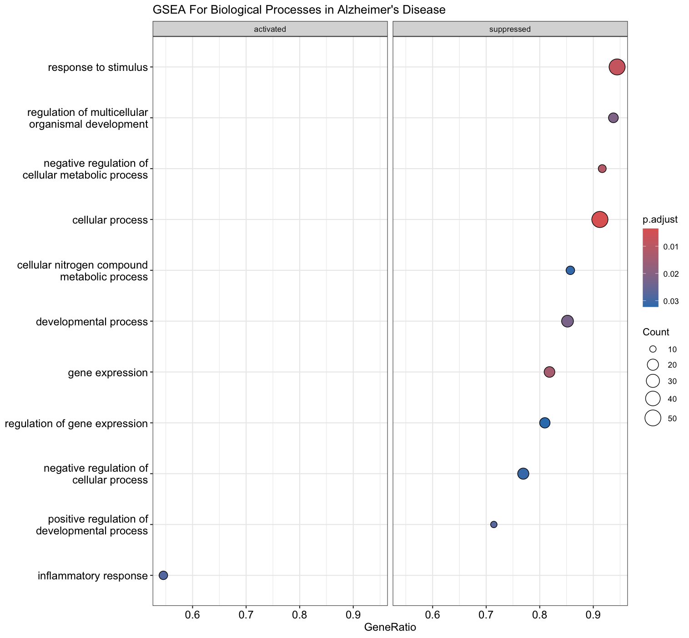
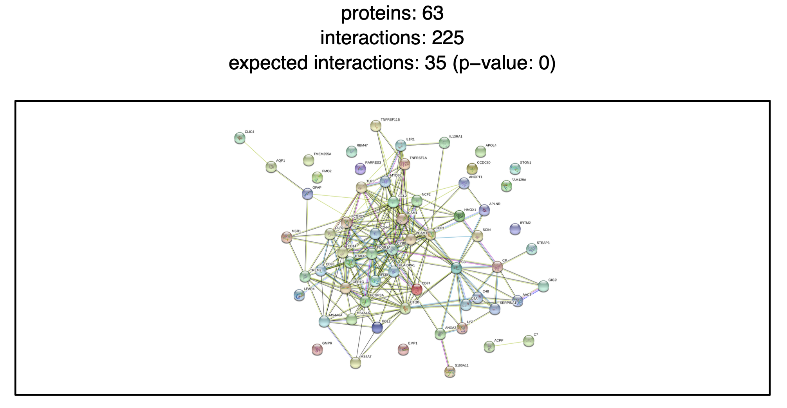
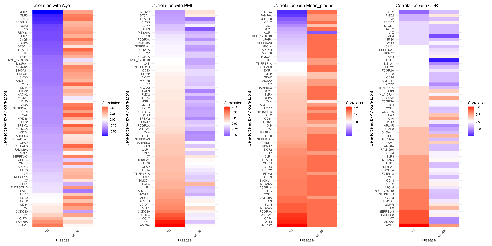

```{r setup, include=FALSE}
knitr::opts_chunk$set(echo = TRUE)
```

```{r, message = FALSE, include=FALSE}
packages <- c("dplyr", "DESeq2", "pheatmap", "ggplot2", "ggrepel", 
              "edgeR", "limma", "enrichR", "pathview", "openxlsx", 
              "RColorBrewer", "gridExtra", "stringr", "knitr", "prettydoc", 
              "caret", "pROC", "C50", "statmod", "e1071", "reshape", 
              "MASS", "pvclust", "randomForest", "ncvreg", "devtools", 
              "clusterProfiler", "org.Hs.eg.db", "enrichplot", "BioStudies", "readr", "STRINGdb")
  
invisible(lapply(as.list(packages), require, character.only = TRUE))
```

This preceding report summarises the statistical project completed as part of the Statistics in Bioinformatics course at the University of Örebro between 25 to 29 November 2024, as part of the The Swedish National Graduate School in Medical Bioinformatics (MedBioInfo). Feedback received during the project presentation is interspersed in blue boxes below, for a more comprehensive picture to be provided to the reviewer. The author contributions include the gene set enrichment analysis, of which a part is presented in [Gene-Disease Exploration], and additional correlation analysis that has been left out of this report for brevity. 

# Data Background and Introduction
Scheckel et al. had explored the role of neuronal ELAV (nELAVL) proteins in post-mortem Alzheimer's disease (AD) using RNA sequencing data from 9 Alzheimer's patients and 8 controls. In this data set, the sequencing data is presented as count data of the transcriptome, with 19185 genes specified. Alongside sequencing data, patient metadata detailing their age, post-mortem interval, clinical diagnosis rating, plaque values, CLIP values and sequencing bactch information were found. 

As a background, RNA-seq (RNA sequencing) analyzes and quantifies RNA in a sample, and identifies the types and levels of RNA molecules. This thus provides insights into gene expression that can contribute to a better understanding of disease incidence.

From the investigation by Scheckel et al., an increased association between nELAVL with non-coding Y RNAs during stress, which disrupts normal mRNA binding and regulation was observed. It is believed that this could potentially contribute to AD pathology. 

## Aims
This project investigates RNA-seq data from 9 Alzheimer's patients and 8 controls, to find specific genes and proteins that are significantly associated with an Alzheimer's diagnosis. Additionally, we are interested in exploring this in the context of patient metadata information.  

# Summary of Findings
## Pre-processing
As RNA-seq experiments generate relative measurements, normalisation is required for comparison between samples. In this case, we use the mean log2 counts-per-million (CPM) to perform quality control on the sequencing data, while accounting for the batch effect in the processing of sequencing samples. Low counts of less than 1 were filtered out, leaving behind 14950 genes. A histogram of normalised CPM counts reported across all samples can be seen below. 

```{r load data, include=FALSE}
# Load gene expression count data
count_data <- read.table("data/GSE53697_RNAseq_AD.txt", header = TRUE, sep = "\t", row.names = 1) %>%
  dplyr::select(matches("_raw$"))
```

```{r preprocess data, include=FALSE}
# Round counts to integers
count_data_filtered <- count_data %>% 
  dplyr::select(starts_with("C"), starts_with("A")) %>%
  mutate_all(~round(.))
```

```{r filter low counts using mean log2 CPM, echo=FALSE}
count_data_filtered <- count_data
genes_before_filtering <- nrow(count_data_filtered)
#cat("Number of genes before filtering:", genes_before_filtering, "\n")
dge <- DGEList(counts = count_data_filtered)
# dge <- calcNormFactors(dge)
meanLog2CPM <- rowMeans(log2(cpm(dge) + 1))
hist(meanLog2CPM, main = "Histogram of Mean Log2 CPM", xlab = "Mean Log2 CPM")
count_data_filtered <- count_data_filtered[meanLog2CPM > 1, ]
genes_after_filtering <- nrow(count_data_filtered)
#cat("Number of genes after filtering:", genes_after_filtering, "\n")
sample_conditions <- data.frame(
  sample = colnames(count_data_filtered),
  condition = ifelse(grepl("^C", colnames(count_data_filtered)), "HC", "AD"),
  batch = c(0, 0, 0, 1, 1, 1, 1, 1, 0, 0, 0, 1, 1, 1, 1, 1, 1)  # Manually adding batch information
)
```

As it is important to account for differences in transcriptome composition, library sizes were scaled according to calculated sample normalisation factors. As count data almost always shows non-trivial mean-variance relationships, the mean-variance trend for the computed log2 CPM was estimated, before being used to compute appropriate observation-level weights based on the predicted variance. The end goal is to ensure the data is ready for linear modelling as the weights are used to adjust for heteroscedasticity. The new data distribution after normalisation is seen below. 

```{r, echo=FALSE}
dge <- DGEList(counts = count_data_filtered)
#dge <- calcNormFactors(dge)
# design <- model.matrix(~ condition + batch, data = sample_conditions)
design <- model.matrix(~ condition + factor(batch), data = sample_conditions)
v <- voom(dge, design, plot = FALSE)
hist(v$E, breaks = 50, main = "Distribution of Voom Normalized Counts", xlab = "Voom Normalized Counts")
```

Using Spearman correlation, the correlation between the different patient conditions were analysed using their now normalised count information. This was visualised with the heatmap seen below. 

```{r, echo=FALSE}
sampleDist <- cor(v$E, method = "spearman")
sampleColor <- brewer.pal(3, "Accent")[1:2]
names(sampleColor) <- unique(sample_conditions$condition)

pheatmap(sampleDist,
  clustering_distance_rows = as.dist(1 - sampleDist),
  clustering_distance_cols = as.dist(1 - sampleDist),
  annotation_col = data.frame(Condition = sample_conditions$condition, row.names = sample_conditions$sample),
  annotation_colors = list(Storage = sampleColor),
  main = "Sample Correlation Heatmap by Condition")
```

Principal Component Analysis (PCA) was also performed on the normalised data, in relation to patient condition.

```{r, echo=FALSE}
pcaRes <- prcomp(t(v$E))
varExp <- round(pcaRes$sdev^2 / sum(pcaRes$sdev^2) * 100)
pcaDF <- data.frame(
  PC1 = pcaRes$x[, 1],
  PC2 = pcaRes$x[, 2],
  Condition = sample_conditions$condition,
  Sample = sample_conditions$sample
)
pcaPlot <- ggplot(
  data = pcaDF,
  mapping = aes(x = PC1, y = PC2, color = Condition, label = Sample)
) +
  geom_point(size = 3) +
  geom_text_repel(size = 4) +
  labs(x = paste0("PC1 (", varExp[1], " %)") ,
       y = paste0("PC2 (", varExp[2], " %)") ,
       title = "PCA Plot of Samples") +
  theme_minimal() +
  theme(axis.text = element_text(size = 12), legend.text = element_text(size = 10)) +
  scale_color_manual(values = brewer.pal(3, "Accent")) +
  coord_fixed(ratio = 1)  # Added fixed ratio to ensure equal scaling between PC1 and PC2
print(pcaPlot)
```

At this point, the Alzheimers patient cluster appears to be close together. However, the controls appear to be lying far out (see C2, C5 and C6), or in the centre of the cluster of Alzheimers patients (see C1). 

We then also evaluted the correlation between the sequencing batch information and normalised count data. The resultant heatmap and PCA plots can be seen below. 

```{r QC: batch heatmap, echo=FALSE}
# Create a heatmap showing Batch 1 and Batch 2 samples separately
sampleDist_batch <- cor(v$E, method = "spearman")
batchColor <- brewer.pal(3, "Set2")[1:2]
names(batchColor) <- unique(sample_conditions$batch)

pheatmap(sampleDist_batch,
  clustering_distance_rows = as.dist(1 - sampleDist_batch),
  clustering_distance_cols = as.dist(1 - sampleDist_batch),
  annotation_col = data.frame(Batch = factor(sample_conditions$batch), row.names = sample_conditions$sample),
  annotation_colors = list(Batch = batchColor),
  main = "Sample Correlation Heatmap by Batch")
```

```{r QC: PCA by Batch, echo=FALSE}
# PCA Plot by Batch
pcaRes_batch <- prcomp(t(v$E))
varExp_batch <- round(pcaRes_batch$sdev^2 / sum(pcaRes_batch$sdev^2) * 100)
pcaDF_batch <- data.frame(
  PC1 = pcaRes_batch$x[, 1],
  PC2 = pcaRes_batch$x[, 2],
  Batch = factor(sample_conditions$batch),
  Sample = sample_conditions$sample
)
pcaPlot_batch <- ggplot(
  data = pcaDF_batch,
  mapping = aes(x = PC1, y = PC2, color = Batch, label = Sample)
) +
  geom_point(size = 3) +
  geom_text_repel(size = 4) +
  labs(x = paste0("PC1 (", varExp_batch[1], " %)"),
       y = paste0("PC2 (", varExp_batch[2], " %)"),
       title = "PCA Plot of Samples by Batch") +
  theme_minimal() +
  theme(axis.text = element_text(size = 12), legend.text = element_text(size = 10)) +
  scale_color_manual(values = brewer.pal(3, "Set2")) +
  coord_fixed(ratio = 1)
print(pcaPlot_batch)
```


```{r QC: outlier removal, include=FALSE}
# Remove identified outliers
# outliers <- c("C1_raw", "C2_raw", "C4_raw", "C5_raw", "C6_raw")
outliers <- c("C1_raw", "C5_raw", "C6_raw")
remaining_samples <- setdiff(colnames(count_data_filtered), outliers)
count_data_filtered <- count_data_filtered[, remaining_samples]
sample_conditions <- sample_conditions[!sample_conditions$sample %in% outliers, ]
```

At this stage, data points C1, C5 and C6 were removed from further analysis as they had been identified as outliers. 

<div class="alert alert-info">
  <strong>Presentation Feedback!</strong> This performed PCA should not have led to outlier removal, and it would have been better to maintain all data points due to the small sample size.
</div>


## Gene-Disease Exploration
At this point, statistical analysis was performed to identify the genes significantly associated with Alzheimer's disease. The required design matrix was designed to include the batch effect as a factor, with the false discovery rate of 0.05 and an absolute log fold change of 1 used as thresholds. The resultant volcano plot is seen below, with 63 genes identified as significant. All 63 of these genes were upregulated, and have been found in literature surrounding Alzheimer's disease.

```{r, echo=FALSE, include=FALSE}
# Define design matrix including batch effect
# designMatrix <- model.matrix(~ 0 + condition + batch, data = sample_conditions)
designMatrix <- model.matrix(~ 0 + condition + factor(batch), data = sample_conditions) 

colnames(designMatrix) <- make.names(colnames(designMatrix))  # Ensure valid column names for contrast matrix
cat("Design Matrix with Batch Effect:\n")
print(head(designMatrix))

# Define contrast matrix
contrastMatrix <- makeContrasts(AD_vs_HC = conditionAD - conditionHC, levels = designMatrix)
cat("Contrast Matrix:\n")
print(contrastMatrix)

# Prepare DGEList and estimate dispersion
dge <- DGEList(count_data_filtered)
#dge <- calcNormFactors(dge)
dge <- estimateDisp(dge, designMatrix, robust = TRUE)

# Fit the model using likelihood ratio test (LRT), now including batch in the design
fit <- glmFit(dge, designMatrix)
lrt <- glmLRT(fit, contrast = contrastMatrix)
```

```{r hypothesis testing, echo=FALSE, include=FALSE}
res <- topTags(lrt, n = nrow(count_data_filtered))
res$table$FDR <- p.adjust(res$table$PValue, method = "BH")
cat("Summary of p-values:\n")
print(summary(res$table$PValue))
cat("Summary of FDRs:\n")
print(summary(res$table$FDR))
sigRes <- subset(res$table, FDR < 0.05 & abs(logFC) > 1)
cat("Number of significant genes:", nrow(sigRes), "\n")
knitr::kable(head(sigRes))
```

```{r, echo=FALSE, warning=FALSE}
volcanoPlot <- ggplot(res$table, aes(x = logFC, y = -log10(FDR),
                                     color = ifelse(FDR < 0.05 & abs(logFC) > 1, "darkred", "grey"))) +
  geom_point(alpha = 0.5, size = 2) +
  xlab(expression("Fold Change, Log"[2]*"")) +
  ylab(expression("Adjusted P value, Log"[10]*"")) +
  geom_vline(xintercept = c(-1, 1), linetype = "dotted", linewidth = 1) +
  geom_hline(yintercept = -log10(0.05), linetype = "dotted", linewidth = 1) +
  theme_minimal() +
  theme(legend.position = "none") +
  scale_colour_manual(values = c("darkred", "grey")) +
  geom_text_repel(aes(label = ifelse(FDR < 0.05 & abs(logFC) > 1, rownames(res$table), "")),
                  size = 3, max.overlaps = 10)

print(volcanoPlot)
```

Gene enrichment was also performed using clusterProfiler, with the minimum gene set size as 10 and a p-value significance of 0.05. 




Processes and components associated with significant genes seem fairly general and non-specific to Alzheimer’s patients. However, the activated inflammatory response aligns with recent findings, with Cornell Medicine investigators recently finding that two genetic variants that confer high risk of Alzheimer's disease (AD) together trigger a harmful inflammatory response in the brain's immune cells.

<div class="alert alert-info">
  <strong>Presentation Feedback!</strong> This performed gseGO should have used entire gene set instead of those identified as significant only. The significant subset should be used when running enrichGO instead. 
</div>

## Protein-Disease Exploration
Protein-protein interaction database STRING v11, with 19566 proteins and 2000556 interactions, was leveraged for the identification of protein-protein interactions in relation to the 63 significant genes The resultant network plot can be seen below.


For greater granularity, GLay community clustering was performed to identify clusters within the above biological network. The resultant network can be seen below. 


Gene set enrichment performed within these clusters identified regulation of immune effector process, positive regulation of
cytokine production and humoral immune response as key biological processes for each of the three clusters respectively. All identified processes appear to be related to immune response, in line with the results obtained from [Gene-Disease Exploration].

## Patient-Disease Exploration
Spearman correlation was performed of the 63 significant genes on their age, post-mortem interval, mean plaque value and clinical diagnosis rating. The resultant correlation values were compared across the different patient conditions (AD vs control), as seen in the figure below. 



<div class="alert alert-info">
  <strong>Presentation Feedback!</strong> This performed correlation analysis should have included significance information as well. It was hypothesised by Andreas that rerunning the correlation analysis with random simulated data would lead to the same result as presented here.
</div>

# Reflections
## Statistical challenges related to this work
### Proposed Design and Method Choice
The biggest issue with this work was my unfamiliarity with both the data type and analysis methods - as a background, I work in methods development for environmental metagenomic data in the interest of pandemic preparedness. Thus, while I intuitively understand the presentation of RNA-seq data, as counts per gene across the different patient reads, I was unaware of the covariates and mediators usually associated with this kind of data. As an example, it was during the presentation feedback that I learnt of the importance of normalising for the post-mortem interval. Additionally, the initially performed gene set enrichment analysis using gseGO presented during the course was run on only a subset of genes that had been identified as significant, when in fact it should have been run on the entire gene set. Once again, it was during the presentation feedback that I learnt of the different input types required across the different gene set enrichment functions, as the function enrichGO would have required only the subset of significant genes. Thus, the proposed design was clearly disadvantaged by the limited experience in this specific area. However, it really drove home the need for collaboration with individuals that are experts in their own fields. 

## Statistical challenges in my PhD project
In the context of my own research, there has been limited statistical analysis performed thus far. The majority of the research work that I have completed in the past year have been driven by taxonomic classification and gene annotation in an exploratory manner to environmental metagenomic data for identification of bacterial strains and antimicrobial resistance genes present in our samples. This course has reminded me of the necessity of statistical evaluation when presenting and discussing results, and inspired me to search for statistical methods applied to my field, instead of purely bioinformatics tools targeted to biologists. Key concepts that I found particularly interesting were functional annotation, as it summarises biological impact that differentially expressed genes might have, and may allow for inferences to be drawn from comparing environmental and clinical metagenomic data. Further discussion with Benjamin Ulfenborg also revealed that curating custom gene ontology tools may be useful for my project. Overall, the greatest statistical challenge in my project is entirely the lack of statistics.

## Acknowledgements
I would like to take this opportunity to thank my group members Emil Johansson, Inika Prasad and Yuqi Zheng for making this entire project a wonderful experience. I'd also like to thank Benjamin Ulfenborg, Andreas Tilevik and Dirk Respilber for sharing their experience and expertise with us over the duration of this course. Additionally, I'd like to thank MedBioInfo for giving me the opportunity to attend this course.


